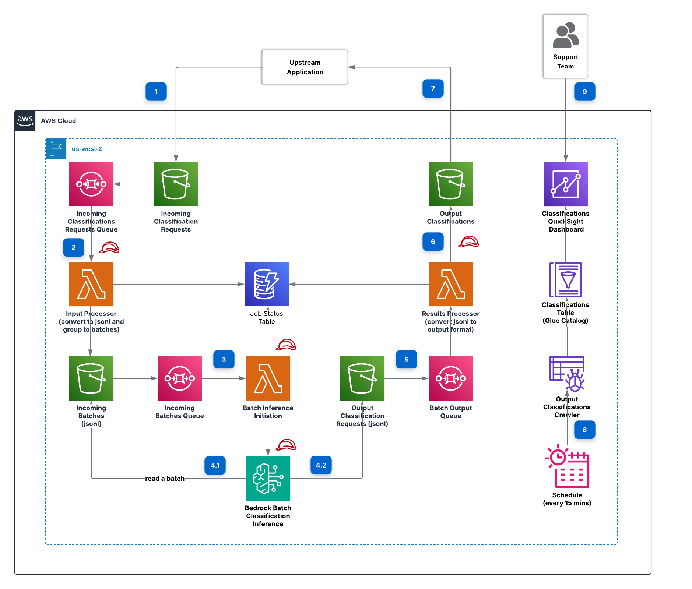

# genai-bedrock-batch-classifier
## Context
In today's fast-paced business environment, organizations across various sectors face a common challenge: the need to efficiently handle high-volume classification tasks. From travel agency call centers categorizing customer inquiries to sales teams analyzing lost opportunities and finance departments classifying invoices, these manual processes are a daily necessity. And this come with significant challenges.

The manual approach to analyzing and categorizing these requests is not only time-intensive but also prone to inconsistencies. As teams processes the high volume of data, the potential for errors and inefficiencies grows. By implementing automated systems to classify these interactions, multiple departments stand to gain substantial benefits. They can uncover hidden trends in their data, significantly enhance the quality of their customer service, and streamline their operations for greater efficiency. 

However, the path to effective automated classification is not without its own challenges. Organizations must grapple with the complexities of efficiently processing vast amounts of textual information while ensuring consistent accuracy in their classification results. And the goal here is to create a fully automated workflow from start to finish, all while keeping operational costs under control. 

## Architecture
An architecture has been implemented that leverages a serverless, event-driven, scalable design to effectively handle and classify large quantities of classification requests. The system was built on AWS, and is automatically triggered when new classification request data is received in an Amazon Simple Storage Service (S3) bucket. Content is then analyzed and categorized at scale using Amazon Bedrock's batch processing capabilities, and the need for constant manual oversight is eliminated.

The architecture follows a well-structured flow that ensures reliable processing of classification requests:

**1/ Data Preparation**
The journey begins when the user or the application submits classification requests into S3 Bucket (**step 1**). These requests are immediately ingested into an Amazon SQS queue, providing a reliable buffer for incoming data and ensuring no requests are lost during peak loads. Next, a serverless data processor, implemented using AWS Lambda function, reads messages from the queue and begins its data processing work (**step 2**). It prepares the data for batch inference, crafting it into the jsonl format with schema that Amazon Bedrock requires. And finally, it stores files in a separate S3 bucket to maintain a clear separation from the original S3 bucket shared with the customer's application, enhancing security and data management.

**2/ Batch Inference**
As the prepared data settles into its new home in S3 bucket, it doesn't rest for long and it immediately initiates a notification to an SQS queue. This queue activates AWS Lambda function, batch initiator, bringing us to the heart of the solution: the batch inference process. The function then submits Amazon Bedrock Batch Inference jobs through the CreateModelInvocationJob API (**step 3**). This initiator acts as the bridge between the queued data and Amazon Bedrock's powerful classification capabilities. Amazon Bedrock then efficiently processes the data in batches. This batch processing approach allows for optimal use of resources while maintaining high throughput. In the end, as Amazon Bedrock completes its task, the classification results are directed into an output bucket (**step 4**). Here, the newly classified data is stored, ready for the next stage of post-processing and analysis.

**3/ Classification Results Processing**
After classification is complete, the system doesn't just file away the results. Instead, it actively processes them through another Amazon SQS queue (**step 5**) and specialized AWS Lambda function, which organizes the classifications into easy-to-read files, such as CSV, JSON or XLSX based on your choice (**step 6**). These files are immediately available to both the customer's applications and support teams who need to access this information (**step 7**).

**4/ Analytics**
And to make all this data truly useful, we've built an analytics layer that automatically catalogs and organizes the classification results, transforming raw classification data into actionable insights. Think of it as a smart library system where AWS Glue Crawler acts as the librarian, cataloging everything so it can be easily found later (**step 8**). And now, your business teams can leverage Amazon Athena to run SQL queries against the data, uncovering patterns and trends in the classified categories. Moreover, we've built Amazon QuickSight dashboard, that provides visualization capabilities, allowing stakeholders to transform datasets into actionable reports ready for decision making. (**step 9**).

We leverage AWS best practices in this solution, including event-driven and batch processing for optimal resource utilization, batch operations for cost-effectiveness, decoupled components for independent scaling, and least privilege access patterns. We implemented the system using CDK (TypeScript) for infrastructure-as-code and Python for application logic, ensuring we achieve seamless automation, dynamic scaling, and efficient processing of classification requests, positioning it to effectively address both current requirements and future demands.

## Prerequisites

To perform the solution, you need the following prerequisites:

* An active [AWS account](https://signin.aws.amazon.com/signin?redirect_uri=https%3A%2F%2Fportal.aws.amazon.com%2Fbilling%2Fsignup%2Fresume&client_id=signup).
* An AWS Region from the list of batch inference [supported Regions](https://docs.aws.amazon.com/bedrock/latest/userguide/batch-inference-supported.html) for Amazon Bedrock.
* Access to your selected models hosted on Amazon Bedrock. Make sure the [selected model has been enabled](https://docs.aws.amazon.com/bedrock/latest/userguide/getting-started.html) in Amazon Bedrock. The solution is configured to use Claude 3 Haiku by default.
* Sign Up for [Amazon Quicksight](https://docs.aws.amazon.com/quicksight/latest/user/signing-up.html) in the same [region](https://docs.aws.amazon.com/quicksight/latest/user/regions-qs.html) as the main application will be deployed. Note, this subscription process configure access to Athena and S3 Bucket Services.
* In Amazon QuickSight, create a [group](https://docs.aws.amazon.com/quicksight/latest/user/creating-groups-console.html) named 'quicksight-access'  for managing dashboard access permissions. Make sure to add your own role to this group so you can access the dashboard after it's deployed. Note: If you use a different group name, you'll need to modify the corresponding name in the codeaccordingly.
* To set up the AWS CDK, install the CDK Command Line Interface (CLI) using the instructions available in the [AWS documentation](https://docs.aws.amazon.com/cdk/v2/guide/cli.html). Follow the steps outlined in this guide to complete the installation process.

## Deployment

Follow these steps to set up and deploy the solution:

* **Clone the Repository**: Run the command  `git clone git@github.com:aws-samples/sample-genai-bedrock-batch-classifier.git`
* **Set Up AWS Credentials**: Create IAM user with appropriate permissions or you can choose Admin for the simplicity, generate credentials for Amazon Command Line Interface (CLI) access and create a profile by following steps in [this article](https://docs.aws.amazon.com/cli/v1/userguide/cli-authentication-user.html). 
* **Bootstrap the Application**: Navigate to the CDK folder and run the command `npm install && cdk bootstrap --profile {your_profile_name}`, replacing {your_profile_name} with your actual AWS profile name. 
* **Review Configuration (Optional)**: Although this step is optional, we recommend reviewing the configuration options available in this section before proceeding with the deployment, as it will help you understand what customizations are possible.
* **Deploy the Solution**: Run the command `cdk deploy --all --profile {your_profile_name}`, replacing {your_profile_name} with your AWS profile name.

Upon successful completion of the deployment process, you'll see a total of 6 stacks created in your AWS account, where:

**SharedStack** acts as a central hub for resources that multiple parts of the system need to access. Within this stack, there are two S3 buckets: one handles internal operations behind the scenes, while the other serves as a bridge between the system and customers, allowing them to both submit their classification requests and retrieve their results.

**DataPreparationStack** serves as a data transformation engine. It's designed to handle incoming files in three specific formats: XLSX, CSV, and JSON, which are currently the only supported input formats. This stack's primary role is to convert these inputs into the specialized JSONL format required by Amazon Bedrock. You can find the script responsible for data processing here. This transformation ensures that all incoming data, regardless of its original format, is properly structured before being processed by the Amazon Bedrock service.

**BatchClassifierStack** is the heart of the system that handles all classification operations. While currently powered by the Anthropic Claude Haiku model, the system maintains flexibility by allowing easy switches to alternative models as needed. This adaptability is made possible through a comprehensive constants file that serves as the system's control center. Please, see all configurations available:
* `PREFIX`: Resource naming convention (‘genai’ is by default)
* `BEDROCK_AGENT_MODEL`: Model selection
* `BATCH_SIZE`: Number of classifications per output file (enables parallel processing), but the minumum should be 100
* `CLASSIFICATION_INPUT_FOLDER`: Input folder name in S3 Bucket that will be used for uploading incoming classification requests
* `CLASSIFICATION_OUTPUT_FOLDER`: Output folder name in S3 where the output files will be available after the classification completes
* `OUTPUT_FORMAT`: Supported formats (CSV, JSON, XLSX)
* `INPUT_MAPPING`: provides a flexible data integration approach that adapts to your existing file structures rather than requiring you to adapt to ours. At its core, it consists of two key fields:
    * `record_id`: Optional unique identifier (auto-generated if not provided)
    * `record_text`: Text content for classification
* `PROMPT`: Template for guiding the model's classification behavior. We developed a prompt template's sample that is available [here](cdk/lib/constants/prompts/travel.ts) file. Please, pay attention into the structure of template's sample that guides the AI Model through its decision-making process. The template not just combines a set of possible categories, but also contains instructions, requiring the model to select a single category and present it within <class> tags. These instructions help maintain consistency in how the model processes incoming requests and saves the output.

**BatchResultsProcessingStack** functions as data post-processing stage, transforming Bedrock's JSONL output into user-friendly formats. Currently, the system supports CSV, JSON, and XLSX based on your choice. These processed files are then stored in a designated output folder within the S3 bucket, organized by date for easy retrieval and management. The conversion scripts are available [here](app/lambda/batchResultsProcessing/__init__.py). The output files has the following schema:

* `ID`: Resource naming convention
* `INPUT_TEXT`: Initial text that was used for classification
* `CLASS`: the classification category
* `RATIONALE`: Reasoning or explanation of given classification

**AnalyticsStack** provides a Business Intelligence Dashboard that displays a list of classifications and allows filtering based on classified categories. It offers key configuration options:
* `ATHENA_DATABASE_NAME`: Defines the name of Athena database that is used as a main data source for QuickSight Dashboard.
* `QUICKSIGHT_DATA_SCHEMA`: Defines how labels should be displayed on the dashboard and specifies which columns are filterable.
* `QUICKSIGHT_PRINCIPAL_NAME`: Designates the principal group that will have access to the Amazon QuickSight Dashboard. The group should be created manually before deploying the stack.
* `QUICKSIGHT_QUERY_MODE`: Allows you to choose between SPICE or direct query for fetching data, depending on your use case, data volume, and data freshness requirements. The default setting is direct query.

Now that you've successfully deployed the system, it's time to put it to work. Start by preparing your data file - this can be either real customer data or a synthetic dataset we've provided for testing (you can find the sample file here). Once you have your file ready, navigate to the S3 bucket named "{prefix}-{account_id}-customer-requests-bucket-{region}" and upload your file to input_data folder. The system will automatically begin processing your data without requiring any manual intervention - just sit back and let the system do its job. After the completion of batch inference job, you can view the classification results on the dashboard. You can find it under the name "{prefix}-{account_id}-classifications-dashboard-{region}". Take a look at the following screenshot to get a preview of what you can expect:

## Known Limitations

These limitations define the operational boundaries of the classification solution and should be considered when planning its use:

* **Minimum Batch Size**: Bedrock Batch Inference requires at least 100 classifications per batch.
* **Processing Time**: While Amazon Bedrock strives to provide completion times within 24 hours, this timeframe is a best-effort estimate and cannot be guaranteed.
* **Input File Formats**: The solution currently supports only CSV, JSON, and XLSX file formats for input data.

## Clean up
To avoid additional charges, remember to clean up your AWS resources when they're no longer needed by running the command `cdk destroy --all --profile {your_profile_name}`, replacing {your_profile_name} with your AWS profile name.

To remove all resources associated with this project, start by accessing the AWS Console and heading to the S3 service. Once there, you'll need to locate two specific buckets by searching for your "{prefix}". These buckets will be named "{prefix}-{account_id}-customer-requests-bucket-{region}" and "{prefix}-{account_id}-internal-classifications-bucket-{region}". Both of these buckets should be deleted to ensure proper cleanup.

After handling the S3 buckets, the next step is to clean up the DynamoDB resources. Navigate to the Amazon DynamoDB console and look for a table named "{prefix}-{account_id}-batch-processing-status-{region}". Once you've found this table, proceed with its deletion to complete the cleanup process.

This comprehensive cleanup ensures that no residual resources remain in your AWS account from this project.

## Conclusion

We've explored how Amazon Bedrock Batch Inference can transform your large-scale text classification workflows. Think about those time-consuming tasks your teams handle daily—analyzing lost sales opportunities, categorizing travel requests, processing insurance claims—all of these can now be automated efficiently. This solution frees your teams to focus on what truly matters: growing and improving your business.

And we're just scratching the surface. Picture a future where your system provides real-time classifications, seamlessly integrates with all your communication channels, offers enhanced monitoring capabilities, and supports multiple languages for global operations.

## Useful Links
* https://docs.aws.amazon.com/cdk/v2/guide/best-practices.html

## Security

See [CONTRIBUTING](CONTRIBUTING.md#security-issue-notifications) for more information.

## License

This library is licensed under the MIT-0 License. See the LICENSE file.

